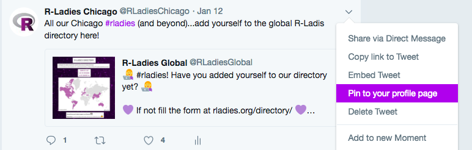

```{r setup,include=FALSE}
knitr::opts_chunk$set(cache=FALSE,echo=FALSE)
library(dplyr)
library(kableExtra)
library(emo)
```

```{r, echo=TRUE, eval=FALSE}
library(dplyr)
r-users %>%
  filter(team == 'r-ladies')
```

  
  
  
  
  
## About  
  
The R-Ladies RoCur (RoCur = Rotating Curation) is a rotating curation twitter handle, **@[WeAreRLadies](https://twitter.com/WeAreRLadies)**, that will feature an awesome R-Lady each week. This account is run by R-Ladies Global.      
  
  
**[R-Ladies](https://rladies.org/)** is a worldwide organization whose mission is to promote gender diversity in the R Community. Our primary focus, therefore, is on supporting minority gender R enthusiasts to achieve their programming potential, by building a collaborative global network of R leaders, mentors, learners, and developers to facilitate individual and collective progress worldwide.  
  
  
  
   
### Objectives  
  
1. To encourage and maintain Twitter engagement within the R-Ladies community.    
2. To spotlight female and minority genders (including but not limited to cis/trans women, trans men, non-binary, genderqueer, agender) and their great work in R.   
  
  
***  
  
  
## How It Works  
  
Every week, a different R-Lady takes over our twitter account to talk about the work they do in R. Featured curators come from a diversity of professions and have a range of experiences in R, from novice to expert.  
  
If you are interested in becoming a curator, see our [Be a Curator](#curating) section and [sign up here](https://goo.gl/forms/bQ7mHQDXrNHXEZCl2).  
  
Check out **@[WeAreRLadies](https://twitter.com/WeAreRLadies)** every Monday for a new curator!    
  

***  
  
  
## Curator Schedule  
  
Here is the current schedule of featured curators.  
  
  
```{r, echo=FALSE, eval=TRUE}
schedule <- as_tibble(read.csv("files/Rocur_Schedule.csv",stringsAsFactors = FALSE))
# schedule_df <- data.frame(read.csv("Rocur_Schedule.csv",stringsAsFactors = FALSE))

schedule$Twitter <- paste0("[", schedule$Twitter, "](", schedule$handle_URL, ")")

kable(schedule[,1:4]) %>%
  kable_styling(bootstrap_options = "striped", full_width = F, position = "left")
```
  
A page with curator bios and an archive of past curators will be up soon!  
  
***  
  
  
## Be a Curator! {#curating}  
  
We are always looking for R-users to be a featured curator for our account! Everyone is welcome; R-Ladies encourages R-users of all professional backgrounds and experience levels to curate this account. Additionally, individuals do not need to be affiliated with R-Ladies to curate. Featured curators must meet the following criteria:  
  
* Curators must identify as female or non-binary.  
* Curators do not need to be affiliated with R-Ladies; however, curators need to register in the [R-Ladies Directory](https://rladies.org/directory/) if they haven’t yet   
* Curators must be individuals (i.e. an R-Ladies Chapter cannot be a featured curator; however, an organizer from a local chapter may curate and tweet about chapter events)   

### Curator Sign Up  
  
Individuals may sign up to be a curator via **[this form](https://goo.gl/forms/bQ7mHQDXrNHXEZCl2)**.   
  
  
* They will be asked to provide a first and second choice.    
* Administrators will make all efforts to honor all scheduling requests but may ask that you be flexible as the administrators need to coordinate multiple schedules.  
* Administrators will contact you to schedule the week you will curate.  
  
   
### How Curating Works  
  
* Curatorship begins each **Monday at 7:00 AM ET** and ends the following **Saturday at 12:00 PM ET**.   
* For the duration of the curatorship, the profile photo will be a photo of the curator.  
* The personal twitter handle of the curator will be in the bio (if applicable; you do not need to be a twitter user prior to curating).   
* Your first post should introduce yourself to the account followers. Your first tweet should tell the audience: what you do (your job, hobbies, etc.), and what you do in R. Pin this tweet so it stays at the top of the feed throughout the week. See more about this under [Twitter Tips](#tweettips).     
* Tweet throughout the week! We do not require that you tweet a specific number of times. But, we ask that you be as active as your schedule allows during your curatorship.  
* Every Sunday, the administrator will update access of the account for the next curator via Tweetdeck.   
  
  
   
### Curating Agreement  

_**By signing on to be a curator of @WeAreRLadies you agree to the following:**_  
  
  
  
1. Abide by R-Ladies’ [Code of Conduct](https://github.com/rladies/starter-kit/wiki/Code-of-Conduct) in all activity and interactions you have on the @WeAreRLadies account.    
  
2. Be the sole tweeter of @WeAreRLadies for the week that you are assigned.  
  
3. Don’t change the photo, biography, background or theme of the  @WeAreRLadies account, unless expressly directed to do so (e.g. changing the profile photo at the start of your week).  
  
4. Provide a profile photo which may be used during your week, and some background information on yourself, including research and interests, for the @WeAreRLadies blog/website.  
  
5. All content posted during your week is your responsibility. That said, the  @WeAreRLadies administrators will take action if your posts contain racism, sexism, homophobia, etc.  
  
6. Refrain from using obscene or abusive language.  
  
7. Don’t actively promote or advertise any business or receive remuneration from a third party to do so.  
  
8. After your assigned week, remove access to @WeAreRLadies from any applications to which you may have granted access.  
  
9. You may not follow, unfollow, or block any other twitter users from the account. Additionally, you may not interact with individuals via direct messages.   
  
10. A curator’s access may be revoked if a disproportionate amount of followers report problems engaging with the curator, or if the curator is inactive on the account.  

*In the event that you receive abuse while contributing, please do block the offender if you feel it necessary. If this does occur, please send the administrators an email at [weare@rladies.org](mailto:weare@rladies.org) or via the R-Ladies Community Slack, noting the offender’s Twitter handle and a description of the offense.* 

Please follow the [Twitter Terms of Service](https://help.twitter.com/en/rules-and-policies/twitter-rules#) The administrators of @WeAreRLadies reserve the right to warn or revoke the access of anyone who violates Twitter’s terms of service or breaches any of the above rules.  
  
  
  
***  
  
  
## Twitter Tips {#tweettips}   
  
### Introducing Yourself  
  
Start your curatorship by introducing yourself, what you do (your job, hobbies, etc.), and what you do in R. *Pin this tweet so that it stays on top of the account feed during your curation week*  
  
Suggestions on how to introduce yourself:    
  
* Share a URL to your website or github or etc.     
* Share your bio that will be posted on the RoCur blog/website.   
  
  

  

### General Tweeting Guidelines        
  
* We do not require that you tweet a specific number of times. But, we ask that you be as active as your schedule allows during your curatorship.    
* The content of your tweets is all up to you! But keep it relevant to R and/or R-Ladies. Make the account and its tweets useful for learning.   
* Tweet pictures/graphics whenever possible.  
    + Posting photos from R-Ladies meetups or other R-related events is highly encouraged.  
    + Please properly attribute your photos and graphics by asking permission from the source if it is not you. Tag the source if you are able.  
    + Tag individuals who are in the photos if you are able.  
* Use hashtags! (See below in [Tweeting about R](#TweetR) for more information on this)   
* Add emojis and gifs when appropriate `r emo::ji("smile")`     
* Have Fun!

### Tweeting about R {#TweetR}  
    
* If you are part of an R-Ladies Chapter, highlight a project your local chapter is working on.  
* Share relevant articles, blog posts, etc. relevant to your work or interests in R.    
* Tell us something you just learned about R.  
* Tell followers about a current R project you are doing (share a line of code or dataviz, link to a package you use a lot).    
* When mentioning a package, add a link to its CRAN/BioConductor/GitHub page.   
    + If possible, tag the Twitter account of the maintainer if this person isn’t too famous yet (e.g. no need to link and tag Hadley Wickham when mentioning ggplot2).   
    + Same goes for courses, books, and etc.   
* Use hashtags whenever possible.  
    + Use the hashtag **#RLadies** whenever possible and relevant.  
    + Use the **#rstats** hashtag when you share something that can be useful for the greater R community (e.g. a cool package); however, don’t use it when saying “Oh I’m doing R look at my screen” because this would create clutter in the R hashtag timeline and potentially lead to people blocking/silencing the account which we do not want. `r emo::ji("wink")`    
  + Some other hashtag examples: **#dataviz, #rspatial, #opendata**    
  + You can also hashtag: package names, the location of your local chapter, etc.
  
  
### Interacting with your audience  
  

  
One goal of @WeAreRLadies is to maintain a strong R-Ladies community on Twitter! Therefore, please respond to people who interact with the account.   
  
If someone asks a question, we suggest re-tweeting their question with your response as a comment so that others can see the original question.  
  
  
*Other suggestions for interacting with your audience:*  
  
* Ask a question about something you are having trouble with in R (our community is all about helping and supporting each other).  
* Ask for recommendations on packages/datasets/features in R for a project you are working on.  
* Create a twitter poll for followers to respond to.  
  
  
***  
  
  
## Contact Us  
  
@WeAreRLadies is managed by R-Ladies Organizers. You can email them at [WeAre@rladies.org](mailto:weare@rladies.org).  


  

